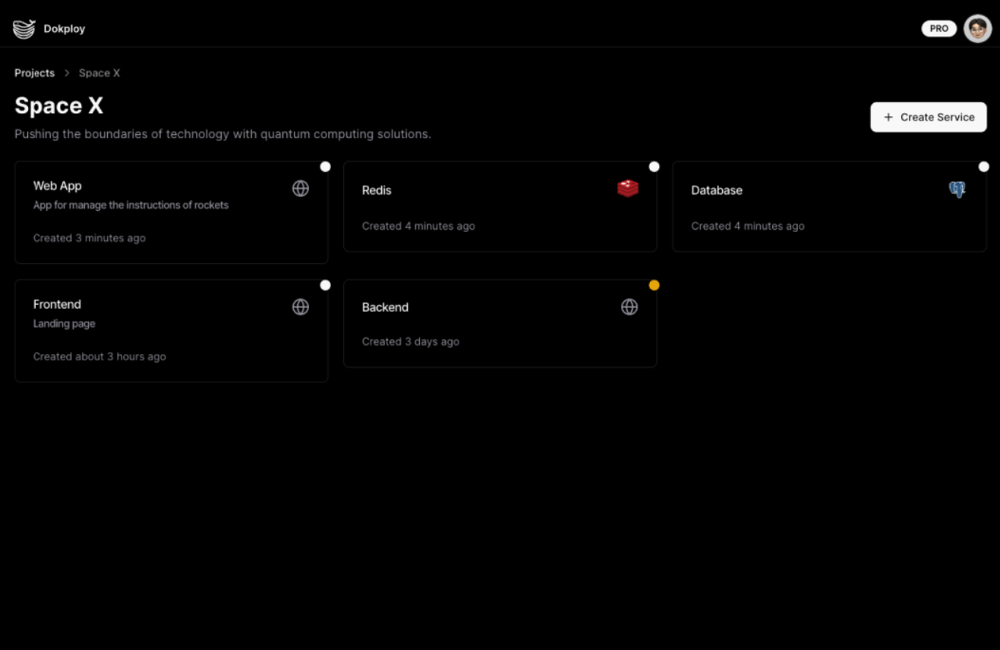

# Dokploy Deployment on OCI Free Tier

This Terraform project deploys a Dokploy instance along with worker nodes in Oracle Cloud Infrastructure (OCI) Free Tier. **Dokploy** is an open-source platform to manage your app deployments and server configurations.

## About Dokploy

Dokploy is an open-source deployment tool designed to simplify the management of servers, applications, and databases on your own infrastructure with minimal setup. It streamlines CI/CD pipelines, ensuring easy and consistent deployments.

For more information, visit the official page at [dokploy.io](https://dokploy.io).

## OCI Free Tier Overview

Oracle Cloud Infrastructure offers a Free Tier that provides resources at no cost, including VM.Standard.E2.1.Micro instances (1 OCPU and 1 GB of RAM), which are ideal for light workloads or testing Dokploy deployments.

Free Tier resources include networking and storage options, which are sufficient for small-scale applications without costs as long as the Free Tier limits are observed. For more details, see [OCI Free Tier](https://www.oracle.com/cloud/free/).

## Prerequisites

Before you begin, ensure you have the following:

-   An Oracle Cloud Infrastructure (OCI) account with Free Tier resources available.
-   An SSH public key for accessing the instances.

## Deploy

*Clicking the "Deploy to Oracle Cloud" button will load the Oracle Cloud Resource Manager to deploy the infrastructure described in this Terraform project. During deployment, you'll be prompted to configure parameters such as SSH keys, the number of worker instances, and the OCI compartment. Review the settings, then launch the stack deployment.*

## Servers & Cluster

### Add Servers to Dokploy

To begin deploying applications, you need to add servers to your Dokploy cluster. A server in Dokploy is where your applications will be deployed and managed.

#### Steps to Add Servers:

1.  **Login to Dokploy Dashboard**:
    -   Access the Dokploy dashboard via the main instance's public IP address. You'll need to use the login credentials configured during setup.
1.  **Generate SSH Keys**:
    -   On the left-hand menu, click on "SSH Keys" and add your private and public SSH key to connect your server.
2.  **Navigate to Servers Section**:
    -   On the left-hand menu, click on "Servers" and then "Add Server."
3.  **Fill in Server Details**:
    -   **Server Name**: Give your server a meaningful name.
    -   **IP Address**: Enter the public IP address of the instance. If you’re using private networking, you can enter the private IP address instead.
    -   **SSH Key**: Select the previous created SSH key.
    -   **Username**: The SSH user for connecting to the server, use `root`.
4.  **Submit**:
    -   After filling out the necessary fields, click "Submit" to add the server.

### Configure a Dokploy Cluster with new workers

After setting up the main Dokploy instance, you can expand your cluster by adding worker nodes. These worker instances will help distribute the workload for your deployments.

See more info about configuring your cluster on the [Dokploy Cluster Docs](https://docs.dokploy.com/en/docs/core/server/cluster).

## Project Structure

-   `bin/`: Contains bash scripts for setting up Dokploy on both the main instance and the worker instances.
    -   `dokploy-main.sh`: Script to install Dokploy on the main instance.
    -   `dokploy-worker.sh`: Script to configure necessary dependencies on worker instances.
-   `helper.tf`: Contains helper functions and reusable modules to streamline the infrastructure setup.
-   `img/`: Directory for images used in the README (e.g., screenshots of Dokploy setup).
-   `locals.tf`: Defines local values used throughout the Terraform configuration, such as dynamic values or reusable expressions.
-   `main.tf`: Core Terraform configuration file that defines the infrastructure for Dokploy's main and worker instances.
-   `network.tf`: Configuration for setting up the required OCI networking resources (VCNs, subnets, security lists, etc.).
-   `output.tf`: Specifies the output variables such as the IP addresses for the dashboard and worker nodes.
-   `providers.tf`: Declares the required cloud providers and versions, particularly for Oracle Cloud Infrastructure.
-   `README.md`: This file, providing instructions on deployment and usage.
-   `variables.tf`: Defines input variables used in the project, including compartment ID, SSH keys, instance shape, and more.

## Terraform Variables

Below are the key variables for deployment, which can be defined in `variables.tf` or passed during `terraform apply`:

-   `ssh_authorized_keys`: Your SSH public key for accessing the instances.
-   `compartment_id`: OCI compartment ID for instance deployment.
-   `num_worker_instances`: Number of worker instances to deploy for Dokploy.
-   `availability_domain_main`: Availability domain for the main instance.
-   `availability_domain_workers`: Availability domains for worker instances.
-   `instance_shape`: Instance shape (e.g., VM.Standard.E2.1.Micro) used for deployment.
-   `memory_in_gbs`: Memory size (GB) per instance.
-   `ocpus`: Number of OCPUs per instance.